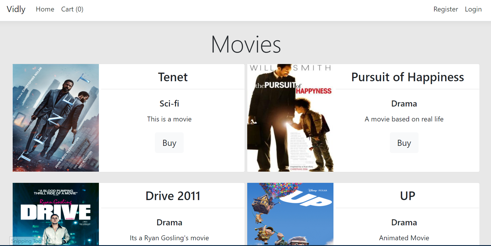
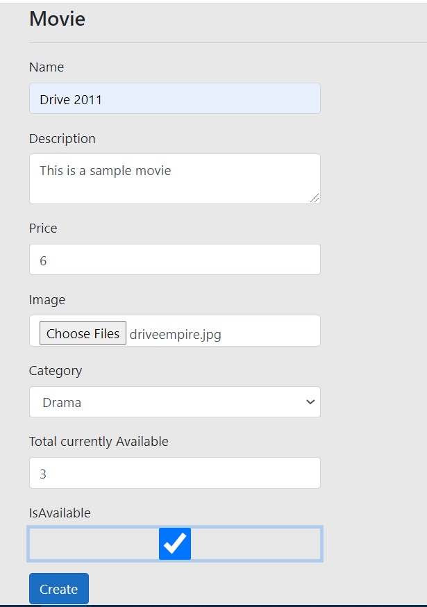

# Vidly
#### A movie purchasing portal.

This project is divided into Area
* Admin
* Customer
* Identity

Landing page of the website comprises of list of movies from where user has to register or login in order to perform any sort of purchase.

## Admin Area
The **Admin area** has controllers for
* Category
* Coupon
* Movie
* User

Every controller provides basic **CRUD** functionality within it,
such as the *category controller* provides Actions to..

1. Create a category
2. Edit a category
3. Delete a category
4. View Details for a category

Similar functionalities have been coded in all other controllers in **Admin Area**.
User can provide Image for a movie to be saved in the database. The Image is saved on
the server rather than on the database.

The **User Controller** is only restricted to manager or a super admin who can see all the employees (Admins) currently working.

## Customer Area
The customer area has the following controllers
* Cart Controller
* Home Controller
* Order Controller

The **Cart controller** handles all the tasks that are performed related to 
adding and removing items from the cart of a user during purchasing.
As the cart is being updated dynamically by the user, the quantity of the movies
being bought or removed from cart are also being updated, no movies with *TotalAvailable*
equal to zero is shown on the home page of the users screen.
If the user has used any coupons, the discount is calculated within this controller and the price is updated
for the *viewModel* so that user can instantly see the discount.

The **Order controller** is used when the user finalises their order and are ready to make a purchase.
There are two actions in this controller.
1. ConfirmOrder
2. PlaceOrder (Post handler)

The *PlaceOrder* action takes the user carts and does entries into the database regarding user order
deletes the carts (empties the cart), and redirects the user to the *ConfirmOrder* action with return the view
of displaying every movie user bought along with the **Total Price** and any coupons used.

